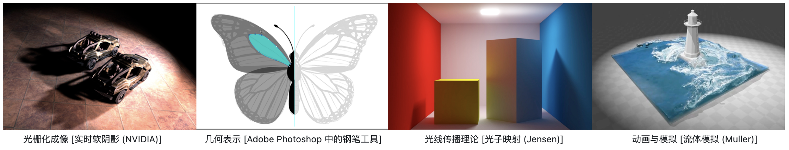

# Awesome-Graphics
This repo contains the resources for computer-graphics.
*Computer graphics deals with by generating images and art with the aid of computers. Today, computer graphics is a core technology in digital photography, film, video games, digital art, cell phone and computer displays, and many specialized applications* from wikipedia.

For me, computer graphics is so cool, since it always involve with cooling demos and it is the intersection of Computer Science, Mathematics and Physics, I love all of them!
